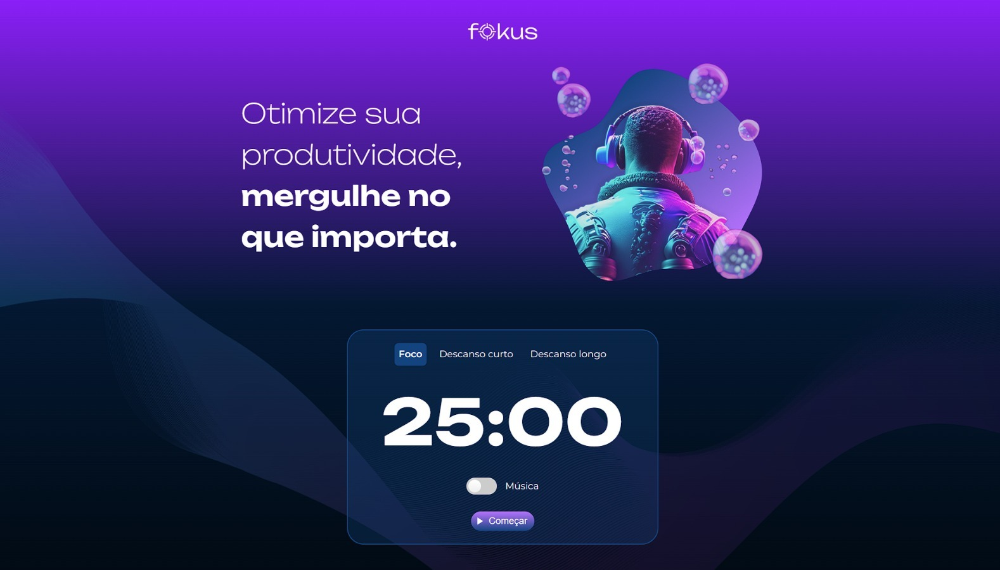

# projetoFokus

Projeto de um temporizador web, tanto para estudo, quanto para descanso, com três periodos de utilização. Foque em você!

| :placard: Vitrine.Dev |     |
| -------------  | --- |
| :sparkles: Nome        | Fokus
| :label: Tecnologias | javascript, CSS, HTML
| :rocket: URL         | https://viniciuschiazza.github.io/projetoFokus/
| :fire: Curso         | Javascript Manipulando o DOM

<!-- Inserir imagem com a #vitrinedev ao final do link -->

